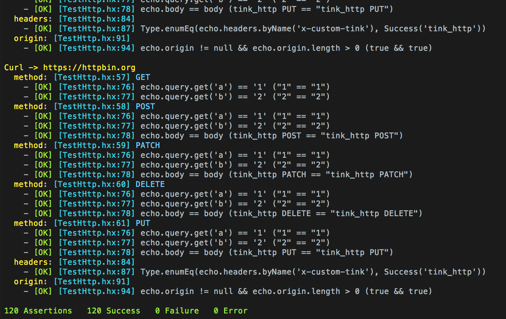

# Tinkerbell Unit Testing

[](https://travis-ci.org/haxetink/tink_unittest)
[](https://gitter.im/haxetink/public)

`tink_unittest` is a unit test framework built on top on `tink_testrunner`.
It transforms test classes into compatible instances to be run by the test `Runner`.



## Table of Contents

**Getting Started**
- [Quick Start](getting-started/quick-start.md) - Create your first test

**Basics**
- [Assertion](basics/assertion.md)
- [Multiple Assertions](basics/multi-assertions.md)
- [Async Tests](basics/async-tests.md)
- [Setup / Teardown](basics/setup-teardown.md)
- [Include / Exclude](basics/include-exclude.md)
- [Test Info](basics/test-info.md)

## Code Demo

The following code snippet demonstrates a few features of this testing framework.
Checkout the links above to learn more in details.

```haxe
import tink.testrunner.Runner;
import tink.unit.Assert.assert;

using tink.CoreApi;

class RunTests {
	static function main() {
		Runner.run(TestBatch.make([
			new NormalTest(),
			new AwaitTest(),
		])).handle(Runner.exit);
	}
}

class NormalTest {
	public function new() {}
	
	@:before public function before() return Noise;
	@:after public function after() return Noise;
	@:startup public function startup() return Noise;
	@:shutdown public function shutdown() return Noise;
	
	@:describe('Sync test')
	public function sync()
		return new Assertion(true, 'Always true');
    
	@:describe('Test using Assert')
	public function syncAssert()
		return assert(true);
		
	@:describe('Async test')
	public function async()
		return Future.sync(new Assertion(true, 'Always true'));
		
	@:describe('Async test using Assert')
	public function asyncAssert()
		return Future.sync(assert(true));
		
	@:timeout(500) // in ms
	@:describe('Timeout test')
	public function timeout()
		return Future.async(function(cb) haxe.Timer.delay(function() cb(assert(true)), 1000));
		
		
	@:describe('Nest')
	@:describe('  your')
	@:describe('    descriptions')
	public function nestedDescriptions()
		return assert(true);
		
	@:describe('Variants')
	@:variant("Variant description" (1, 1))
	@:variant(2, 2)
	@:variant(target.myInt, 3) // access public fields of "this" with "target.field"
	public function variant(a:Int, b:Int) {
		debug('variant$a');
		return assert(a == b);
	}
	
	public var myInt = 3;
}

@:await
class AwaitTest {
  public function new() {}
  
	@:describe('Async test powered by tink_await')
	@:async public function async() {
		var actual = @:await someAsyncValue();
		return assert('expected' == actual);
	}
	
	function someAsyncValue() 
		return Future.async(function(cb) haxe.Timer.delay(function() cb('actual'), 1000));
}
```
